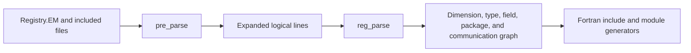

# WRF Registry

The WRF Registry is a domain-specific language and code-generation system. It
describes model dimensions, state variables, runtime configuration, packages,
communication patterns, and I/O metadata. WRF's C program in `tools/registry`
preprocesses Registry sources into an in-memory graph and generates Fortran
includes and modules used throughout the model.

`wrf-registry` is the safe Rust reimplementation of that build-time system. It
does not own live atmospheric fields. Its job is to turn declarative Registry
source into typed metadata and, in later slices, all artifacts required to
build and run WRF-compatible model code.

## Why the Registry exists

Atmospheric state is structurally repetitive but semantically rich. A single
field may need:

- a Fortran declaration with the correct rank and time-level suffix;
- allocation and deallocation code;
- external variable name, description, units, and memory order;
- history, restart, input, and boundary stream membership;
- halo and nesting behavior;
- namelist declaration, default, and group membership; and
- reflection-like links in WRF's state-variable linked list.

Encoding each concern by hand would duplicate facts across the model and make
schema changes error-prone. The Registry is the schema from which those
artifacts are derived.

## Upstream pipeline

The pinned reference is WRF v4.7.1. Its pipeline has two main stages:

`pre_parse` handles includes, `define`/`ifdef`/`ifndef`/`endif`, backslash
continuations, comments, quote-aware tokenization, and selected source
rewrites. `reg_parse` converts positional tokens into linked C `node_t`
records. Generator functions traverse those lists to write files under `inc`
and `frame`.

The Rust implementation makes the intermediate representation explicit and
typed. Parsing lives under `parser`, Registry concepts under `model`, and
artifact generation under `generated_state`. This separation prevents a
build-time parser from becoming an accidental runtime domain object.

## Pinned ARW language inventory

`Registry.EM` directly includes `registry.dimspec` and
`registry.em_shared_collection`. The shared collection recursively includes
`Registry.EM_COMMON`, generated I/O boilerplate, and component registries for
fire, stochastic physics, LES, CAM, CLM, lakes, Noah-MP, spectral-bin
microphysics, diagnostics, IAU, CMAQ, and other optional systems.

The reachable v4.7.1 sources use these language families:

| Family | Observed forms | First-slice status |
|---|---|---|
| preprocessing | `include`, `ifdef`, `endif`, definitions consumed through build flags, continuations, comments | continuations/comments only |
| dimensions | `dimspec`, standard/namelist/constant bounds, coordinate axes | parsed and selected output generated |
| fields | `state`, `i1`, `typedef`, built-in and derived types | `state` plus built-in types parsed |
| configuration | `rconfig`, scalar/expression entry counts, namelist/derived setting | parsed and selected output generated |
| packages | `package`, state and four-dimensional-scalar membership | deferred |
| communication | `halo`, conditional `halo_nta`, `period`, `xpose` | deferred |
| compact syntax | quoted empty/text fields, brace dimensions, `*`, `f/t/x/y/b` dimension modifiers, staggering and I/O strings | empty/text fields, `*`, simple dimensions, modifiers, staggering, and opaque I/O parsed; braces deferred |

This inventory is about syntax reachable from the pinned ARW Registry graph,
not a claim that every optional package is active in one compiled forecast.
Build definitions decide which conditional branches survive preprocessing.

## First supported grammar slice

The initial slice accepts a dependency-closed source containing blank lines,
comments, continuations, empty quoted fields, and three entry categories.
Positional fields are:

| Entry | Fields after keyword |
|---|---|
| `dimspec` | `name order length axis data_name` |
| `state` | `type name dimensions use time_levels staggering io data_name description units` |
| `rconfig` | `type name how_set entry_count default io data_name description units` |

Quoted values may contain spaces and retain case. Unquoted text is folded to
lowercase, matching WRF. A `-` means “not specified” in optional positions.
The parser requires the exact field count for this slice, producing a typed
diagnostic instead of allowing a malformed line to borrow defaults from
uninitialized or placeholder tokens.

### Logical lines and quotes

A backslash at the physical end of a line joins the next physical line without
inserting a character. Each resulting entry retains the location of its first
physical line. An unmatched quote reports the opening quote's physical column.

WRF has an unusual but intentional compatibility behavior for `#`:

- outside quotes, `#` begins a comment;
- inside quotes, `#` is replaced by a space rather than retained.

The Rust tokenizer reproduces this behavior exactly. It is covered by a unit
test because a conventional tokenizer would naturally make a different
choice.

## Dimension specifications

A `dimspec` defines a symbol that state dimension strings can reference.
Supported bound sources are:

- `standard_domain`, whose bounds come from the model domain;
- `namelist=end`, interpreted as inclusive `1:end`;
- `namelist=start:end`, whose inclusive bounds come from two expressions;
- `constant=N`, interpreted as inclusive `1:N`; and
- `constant=(start:end)`, including negative bounds.

The optional order is a one-based model ordering. Standard-domain dimensions
must occupy orders 1, 2, and 3 before `model_data_order.inc` can be generated.
Axes are west-east (`x`), south-north (`y`), bottom-top (`z`), or a
non-spatial/constant coordinate (`c`).

State dimensions resolve in source order, as they do in WRF. Referring to an
undefined or later dimension is an error. The typed `DimensionLength` enum
prevents later generators from repeatedly reparsing raw strings.

## State entries

A state entry records its built-in value type, symbol, resolved dimension
sequence, use association, time-level count, staggering flags, I/O
specification, and metadata. A `-` time-level token follows WRF and defaults to
one; explicit counts must be positive. Supported built-in types are `integer`, `real`,
`logical`, `character*256`, and `doubleprecision`; upstream's `double` alias is
normalized to `doubleprecision`.

The dimension string is compact. In `ikjb`, `i`, `k`, and `j` are dimension
symbols and trailing `b` requests generated boundary storage. The parser also
represents scalar-array (`f`), scalar-tendency (`t`), processor-orientation
(`x`/`y`), and subgrid (`*`) modifiers. Brace-delimited multi-character
dimension names are explicitly deferred.

Staggering is represented as flags rather than an opaque string:

| Flag | Meaning |
|---|---|
| `x`, `y`, `z` | staggered on that coordinate |
| `v` | NMM vertical-grid behavior |
| `m` | microphysics variable |
| `f` | full feedback |
| `n` | no feedback |

I/O strings are preserved for later stream and nesting slices. The initial
generator only needs dimensions, types, names, time levels, boundary status,
and descriptive metadata.

## Runtime configuration

An `rconfig` entry becomes a field in WRF's generated configuration structure.
`entry_count=1` is modeled as a scalar. Expressions such as `max_domains`
become typed expression-sized storage. A `how_set` value beginning with
`namelist,` identifies the generated Fortran namelist group.

Defaults retain their Registry spelling. Character defaults receive quotes
when emitted; numeric and logical defaults do not. This reproduces WRF's
`namelist_defaults.inc` behavior without treating every default as an
unstructured generated line.

## Selected artifact generation

The first generator writes five WRF include files:

| Artifact | Role |
|---|---|
| `state_struct.inc` | configuration and state declarations, including time-level and boundary symbols |
| `namelist_defines.inc` | scalar and dimensioned configuration declarations |
| `namelist_defaults.inc` | default assignments |
| `namelist_statements.inc` | group membership declarations |
| `model_data_order.inc` | the three-axis storage order |

It also writes `state_metadata.txt`, a normalized parity projection of values
that WRF places in generated `allocs_*.F`: variable name, external data name,
description, units, memory order, time-level tag, and rank.

Boundary variables expose a subtle upstream rule. A regular time level of state
`t` with external name `thm` becomes `THM_1`; generated boundary storage is
named from the state symbol and becomes `T_B`, not `THM_B`. Boundary tendency
units become `(K)/dt`. The Rust generator follows those rules and tests them
against WRF output.

## Differential parity

The fixture in `parity/registry/fixtures/registry_arw_slice` is small enough to
audit but includes real ARW forms for potential temperature `t` and column dry
mass `mu`. It covers:

- physical line continuations and quoted metadata;
- all three dimension-length strategies;
- X-Z-Y standard model order;
- scalar and `max_domains` runtime configuration, including the `dt`
  dependency referenced by boundary interpolation metadata;
- logical, integer, and character defaults;
- two state time levels;
- boundary and boundary-tendency generation; and
- complex WRF I/O specifications preserved as source data.

`scripts/run-registry-oracle.sh` builds WRF's pinned `tools/registry`, runs both
generators from the same fixture, extracts metadata from WRF allocation
artifacts, and compares both outputs to committed upstream goldens. The five
include files are byte-identical, including fixed-width declaration spacing.
The eight metadata records also match exactly.

Cargo unit tests consume the same goldens, so ordinary Rust verification does
not require a C compiler or a WRF build. The oracle remains the independent
source-of-truth regeneration path and runs in CI after the checksum-pinned WRF
source is fetched.

## Diagnostics and safety

Every recoverable parser failure is a `RegistryParseError` containing a
`SourceLocation` and typed `RegistryParseErrorKind`. Covered failures include
unbalanced quotes, dangling continuations, incorrect positional counts,
duplicates, unknown dimensions, malformed bound expressions, invalid types,
zero or malformed time levels, invalid staggering, and unsupported entry
categories.

The crate forbids unsafe Rust. Source names are shared through `Arc<str>` so
locations remain inexpensive to clone without lifetime-heavy public APIs.
Field strings are owned because the parsed document must survive independently
of the input buffer. Parsing is linear in source bytes plus dimension lookups,
which use a hash set. This is a build-time workload; no SIMD or elaborate
optimization is justified unless later full-Registry measurements show a
meaningful bottleneck.

## Deliberate exclusions

The following upstream language and generator surfaces remain future slices:

- recursive `include` and conditional preprocessing;
- `typedef`, `i1`, and derived types;
- `package` and four-dimensional scalar-array generation;
- `halo`, `period`, `xpose`, swap, and cycle communication entries;
- brace-delimited multi-character state dimensions;
- complete I/O-mask and nesting-function interpretation; and
- allocation, deallocation, argument, scalar-index, stream, interpolation,
  module-description, and other remaining generators.

Until those are implemented and differentially tested, `wrf-registry` must not
be described as able to compile the full `Registry.EM` graph.
